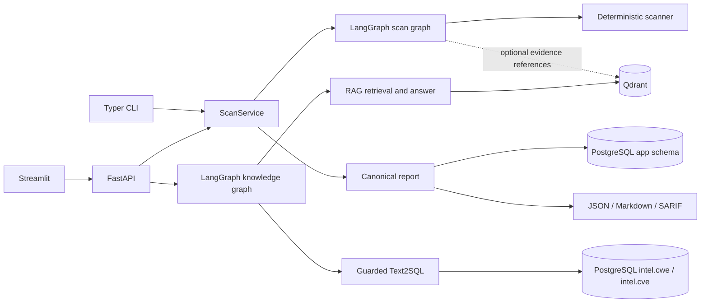

# SecRAGraph

[](https://github.com/taehyeon-git/SecRAGraph/actions/workflows/ci.yml) · [v0.1.0 릴리스](https://github.com/taehyeon-git/SecRAGraph/releases/tag/v0.1.0) · [Code Scanning](https://github.com/taehyeon-git/SecRAGraph/security/code-scanning)

SecRAGraph는 소스 코드를 실행하지 않고 정적 규칙으로 검사하며, LangGraph로 스캔과 보안 지식 질의를 조정하고, 선택적으로 Qdrant RAG 문서 근거와 PostgreSQL CVE/CWE Text2SQL 답변을 제공하는 백엔드·DevSecOps 포트폴리오 프로젝트입니다.

## 문제 정의

보안 검토 결과는 재현 가능한 탐지와 출처가 분명한 설명이 함께 있어야 유용합니다. 이 프로젝트는 파일·ZIP·로컬 디렉터리에서 제한된 텍스트만 읽어 규칙 기반 finding을 만들고, 민감한 증거를 가린 뒤 한 보고서를 JSON, Markdown, SARIF 2.1.0으로 표현합니다. API, CLI, Streamlit 데모, CI가 같은 스캔 엔진을 사용합니다.

실제 [데모 파일](examples/insecure/sample.py)을 CLI로 스캔한 JSON의 일부입니다. `scan_id`와 생성 시각은 실행마다 달라집니다.

```json
{
  "status": "completed",
  "target_name": "sample.py",
  "summary": {"total": 3},
  "findings": [{
    "rule_id": "SEC001",
    "file_path": "sample.py",
    "line_start": 5,
    "redacted_evidence": "DEMO_API_KEY = ***REDACTED***",
    "remediation": "Revoke exposed credentials and load replacements from an approved secret store.",
    "references": []
  }]
}
```

이 발췌는 실제 출력의 일부이며, `summary`의 나머지 필드와 다른 finding 두 건은 생략했습니다. 규칙과 한계는 [아키텍처](docs/architecture.md) 및 [데모 절차](docs/demo.md)에 있습니다.

## 핵심 아키텍처



스캔 그래프는 탐지·위험 점수·수정 권고를 결정적으로 계산합니다. 설정된 경우 Qdrant가 finding에 문서 출처를 추가하지만 수정 권고 문구는 바꾸지 않습니다. PostgreSQL Text2SQL은 별도의 지식 질의 그래프에만 사용됩니다. CLI의 로컬 스캔은 모델 키나 데이터베이스 없이 동작하고, Compose의 API 스캔은 보고서 영속화를 위해 PostgreSQL을 사용합니다.

## LangGraph 워크플로

스캔 경로: `validate_input → deterministic_scan → normalize_findings → retrieve_finding_evidence → calculate_risk → build_report`. Qdrant 또는 임베딩 제공자를 사용할 수 없으면 확인된 finding은 유지하고 경고를 기록합니다. 스캔 경로는 ChatModel이나 PostgreSQL Text2SQL을 호출하지 않습니다.

지식 질의 경로: `classify_intent`가 `general_answer`, `text2sql`, `vector_search` 중 하나를 고릅니다. RAG 경로는 `vector_search → evaluate_vector_results → [rewrite_query/retry | generate_grounded_answer | stop]`로 진행하며, 근거가 없으면 부족하다고 답합니다. 일반 설명 경로에는 저장된 문서 인용이 없으므로 근거 기반 답변으로 해석하면 안 됩니다. 자세한 노드와 인터페이스는 [아키텍처](docs/architecture.md)를 보세요.

## RAG와 Text2SQL

- RAG 수집은 사용자가 실행합니다. 현재 UTF-8 `.md`/`.markdown` 문서만 받으며 PDF 수집은 구현되어 있지 않습니다. 임베딩 모델 키와 Qdrant 컬렉션이 필요합니다. [동봉된 지침](data/knowledge/secragraph-security-guidelines.md)은 이 저장소용으로 새로 작성한 데모 문서입니다.
- Text2SQL은 모델이 만든 SQL을 SQLGlot AST로 검증한 뒤 `intel.cwe`와 `intel.cve`의 제한된 `SELECT`만 읽기 전용 역할로 실행합니다. 행 수·시간·재시도가 제한됩니다. [세부 통제](docs/text2sql-security.md)를 참고하세요.
- [동봉된 CVE/CWE CSV](data/samples/README.md)는 합성 데모 데이터입니다. 실제 취약점 피드나 운영 환경의 지식 범위를 대변하지 않습니다. 외부 자료는 권리를 확인한 사용자가 직접 확보하고 수집해야 합니다.

## 빠른 시작

저장소 루트에서 Docker Desktop의 Linux 엔진(또는 Linux Docker 엔진)을 사용합니다. 아래는 Windows PowerShell 5.1/7 명령이며 두 비밀번호는 현재 셸에만 둡니다. 기존 `postgres_data` 볼륨이 있다면 새 `POSTGRES_PASSWORD` 대신 초기화 당시 비밀번호를 사용하세요. 역할 회전 절차는 [운영 문서](docs/operations.md)에 있습니다.

```powershell
$adminBytes = New-Object byte[] 32
$readerBytes = New-Object byte[] 32
$rng = [Security.Cryptography.RandomNumberGenerator]::Create()
try {
    $rng.GetBytes($adminBytes)
    $rng.GetBytes($readerBytes)
} finally {
    $rng.Dispose()
}
$env:POSTGRES_PASSWORD = [BitConverter]::ToString($adminBytes).Replace('-', '')
$env:SECRAGRAPH_READER_PASSWORD = [BitConverter]::ToString($readerBytes).Replace('-', '')
docker compose config --quiet
docker compose build api web
docker compose up -d
docker compose ps -a
Invoke-RestMethod http://127.0.0.1:8000/health/ready
```

API와 웹 UI는 기본적으로 호스트의 `127.0.0.1:8000`, `127.0.0.1:8501`에서만 열립니다. UI는 브라우저에서 `http://127.0.0.1:8501`로 확인할 수 있습니다. 첫 빌드 시간은 환경에 따라 다릅니다. 비밀번호를 담은 `docker compose config` 전체 출력은 공유하지 마세요.

로컬 CLI는 Python 3.11 이상과 `uv`를 사용합니다. 아래 스캔에는 모델 키·PostgreSQL·Qdrant가 필요하지 않습니다.

```powershell
uv sync --frozen --dev
uv run security-review scan examples/insecure/sample.py --format markdown
uv run security-review scan examples/insecure/sample.py --format sarif --output build/sample.sarif
```

실행 중인 API에 데모 파일을 보내려면 Windows PowerShell에서 `curl.exe`를 사용합니다(Unix 셸에서는 `curl`). JSON 응답의 `scan_id`로 `/v1/scans/{scan_id}` 또는 `/v1/scans/{scan_id}/report?format=markdown|sarif`를 조회할 수 있습니다. OpenAPI는 `http://127.0.0.1:8000/docs`에 있습니다.

```powershell
curl.exe -sS -F "file=@examples/insecure/sample.py;type=text/x-python" http://127.0.0.1:8000/v1/scans/file
```

ZIP은 `POST /v1/scans/archive`에서 검증 후 처리합니다. `POST /v1/knowledge/query`는 별도 지식 기능입니다. 제공자 키, PostgreSQL 데이터, Qdrant에 수집한 문서를 준비한 뒤 호출해야 하며, 빈 Compose 시작만으로 근거 있는 답변이 생성되지는 않습니다. [운영 문서](docs/operations.md)에 샘플 데이터 적재와 Markdown 수집 명령이 있습니다.

## 키 없는 스캐너 평가

동봉된 39개 합성 코드 사례를 실제 `scan_path`로 검사한 결과입니다. 같은 매니페스트를 변경 전 스캐너(`ac88e9f`)와 현재 6개 규칙에 적용했습니다. 매니페스트 SHA-256은 `6d77a9b45f1d9df215892969d3af6ce95f61e4ed20202fad61a24a5330bd6c2d`입니다.

| 검사 | TP / FP / FN | 정밀도 (TP+FP) | 재현율 (TP+FN) | F1 | 정상 사례 오경보 / 적격 사례 | 읽은 사례 / 전체 |
| --- | ---: | ---: | ---: | ---: | ---: | ---: |
| 변경 전 `ac88e9f` | 9 / 6 / 9 | 0.600 (15) | 0.500 (18) | 0.545 | 6/21 (0.286) | 39/39 |
| 현재 규칙 `2026.10.2` | 18 / 0 / 0 | 1.000 (18) | 1.000 (18) | 1.000 | 0/21 (0.000) | 39/39 |

두 실행 모두 건너뛴 사례 0건, Python 파싱 경고 0건, 예상·예상 밖·누락 진단 0건이었습니다. `PY004`와 `JS001`은 변경 전 규칙에 없어서 기준선의 TP가 각각 0건입니다. 이 수치는 규칙 작성자가 만든 작은 고정 코퍼스의 정확 일치 결과이며 임의 저장소의 탐지율이나 실제 취약점 여부를 추정하지 않습니다. [기준선 원본 기록](docs/evidence/scanner-baseline.md)과 [규칙별 수치·재현 절차](docs/demo.md#11-합성-스캐너-벤치마크)를 함께 보세요.

```powershell
uv run python -m scripts.run_scanner_benchmark
```

명령은 키·Docker·네트워크 없이 `build/evidence/scanner.json`과 `scanner.md`를 생성하며, 라벨 불일치·검사 누락·예상 밖 진단이 있으면 0이 아닌 코드로 종료합니다.

## 테스트와 CI

별도 테스트 서비스를 시작하지 않고 아래 코드 품질 검사와 문서·CLI 테스트를 실행할 수 있습니다. [CI 정의](.github/workflows/ci.yml)는 Ruff, mypy, pytest, Bandit, 의존성 감사, 컨테이너 빌드를 구성합니다. [셀프 스캔 정의](.github/workflows/security-scan.yml)는 `src`를 SARIF로 스캔하고 [검증 스크립트](scripts/validate_sarif.py)를 실행합니다. GitHub Code Scanning 업로드는 권한이 허용되는 이벤트에서만 시도하도록 구성되어 있습니다. `v0.1.0` 태그가 가리키는 커밋의 [CI 실행](https://github.com/taehyeon-git/SecRAGraph/actions/runs/37821416468)과 [보안 셀프 스캔](https://github.com/taehyeon-git/SecRAGraph/actions/runs/37821416381)은 모두 통과했고, SARIF는 [Code Scanning](https://github.com/taehyeon-git/SecRAGraph/security/code-scanning)에 게시되었습니다.

```powershell
uv run ruff format --check .
uv run ruff check .
uv run mypy src apps
uv run pytest tests/unit/docs/test_documentation.py tests/e2e/test_cli.py
uv run bandit -q -r src apps
```

전체 `uv run pytest`는 통합 테스트 전용 서비스가 필요합니다. [통합 테스트 Compose](tests/compose.integration.yaml)는 PostgreSQL을 `127.0.0.1:55432`, Qdrant를 `127.0.0.1:56333`에 띄우도록 정의합니다. 일부 테스트는 `SECRAGRAPH_TEST_API_URL`의 실행 중인 API도 필요하며 기본 URL은 `http://127.0.0.1:8000`입니다. 이는 빠른 시작 Compose의 PostgreSQL/Qdrant 기본 호스트 포트 `5432`/`6333`과 별개입니다. 해당 서비스를 준비하지 않은 로컬 환경에서 전체 테스트가 통과한다고 주장하지 않습니다.

## 한계

정적 규칙은 지원되는 파일 유형과 패턴만 다룹니다. 이 프로젝트는 전문 SAST나 비밀 탐지기, 침투 시험을 대체하지 않으며, 탐지 결과가 곧 실제 악용 가능성의 증명도 아닙니다. 인증·다중 테넌트 접근 제어·자동 수정은 구현되어 있지 않으므로 공개 인터넷 서비스로 바로 배포하면 안 됩니다. 모델 답변은 오류나 프롬프트 인젝션 영향을 받을 수 있고, 문서 근거의 품질은 사용자가 수집한 자료에 좌우됩니다. 자세한 경계와 잔여 위험은 [위협 모델](docs/threat-model.md)에 있습니다.

## 출처와 기여

이 프로젝트는 팀 교육 프로젝트 `rag-documents`와 개인 보안 에이전트 실습 `security-agent-langgraph`에서 배운 접근을 독립적으로 통합한 작업입니다. 팀 전체 결과를 개인 단독 성과로 표시하지 않습니다. 직접 기여한 대표 커밋, 개인 실습의 템플릿 경계, 새 SecRAGraph 구현 범위, 자료 권리는 [출처와 크레딧](docs/origins-and-credits.md)에 분리해 기록했습니다. [MIT 라이선스](LICENSE)는 새로 작성한 SecRAGraph 코드에만 적용됩니다.
