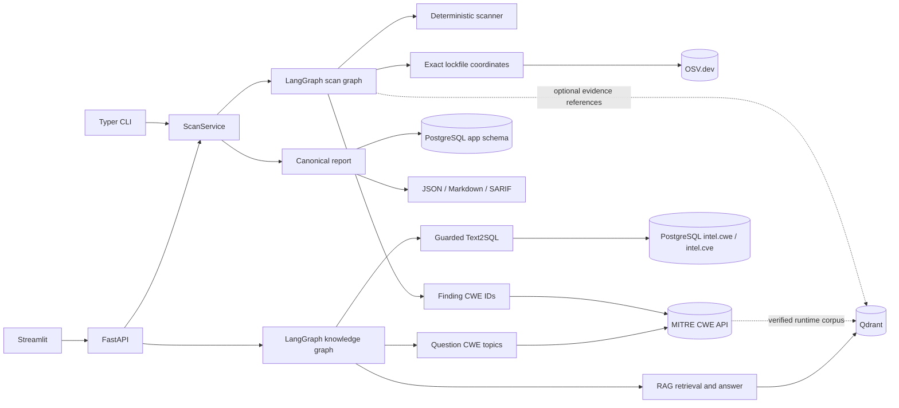

# SecRAGraph

[](https://github.com/taehyeon-git/SecRAGraph/actions/workflows/ci.yml) · [현재 main](https://github.com/taehyeon-git/SecRAGraph/tree/main) · [초기 v0.1.0 릴리스](https://github.com/taehyeon-git/SecRAGraph/releases/tag/v0.1.0) · [Code Scanning](https://github.com/taehyeon-git/SecRAGraph/security/code-scanning)

SecRAGraph는 소스 코드를 실행하지 않고 정적 규칙으로 검사하며, LangGraph로 스캔과 보안 지식 질의를 조정하고, 선택적으로 Qdrant RAG 문서 근거와 PostgreSQL CVE/CWE Text2SQL 답변을 제공하는 백엔드·DevSecOps 포트폴리오 프로젝트입니다.

## 문제 정의

보안 검토 결과는 재현 가능한 탐지와 출처가 분명한 설명이 함께 있어야 유용합니다. 이 프로젝트는 파일·ZIP·로컬 디렉터리에서 제한된 텍스트만 읽어 규칙 기반 finding을 만들고, 소스 줄 대신 규칙별 고정 증거 문구만 담은 보고서를 JSON, Markdown, SARIF 2.1.0으로 표현합니다. API, CLI, Streamlit 데모, CI가 같은 스캔 엔진을 사용합니다.

실제 [데모 파일](examples/insecure/sample.py)을 CLI `--offline`으로 스캔한 JSON의 일부입니다. `scan_id`와 생성 시각은 실행마다 달라집니다.

```json
{
  "status": "completed",
  "target_name": "sample.py",
  "summary": {"total": 3},
  "findings": [{
    "rule_id": "SEC001",
    "file_path": "sample.py",
    "line_start": 5,
    "redacted_evidence": "Secret-like assignment detected: ***REDACTED***; source omitted for privacy.",
    "remediation": "Revoke exposed credentials and load replacements from an approved secret store.",
    "references": []
  }]
}
```

이 발췌는 실제 출력의 일부이며, `summary`의 나머지 필드와 다른 finding 두 건은 생략했습니다. 규칙과 한계는 [아키텍처](docs/architecture.md) 및 [데모 절차](docs/demo.md)에 있습니다.

## 핵심 아키텍처


```mermaid
flowchart LR
  CLI[Typer CLI] --> APP[ScanService]
  WEB[Streamlit] --> API[FastAPI]
  API --> APP
  APP --> SG[LangGraph scan graph]
  SG --> RULES[Deterministic scanner]
  SG --> LOCK[Exact lockfile coordinates]
  LOCK --> OSV[(OSV.dev)]
  SG --> CWE[Finding CWE IDs]
  CWE --> MITRE[(MITRE CWE API)]
  SG -. optional evidence references .-> QD[(Qdrant)]
  APP --> REPORT[Canonical report]
  REPORT --> PG[(PostgreSQL app schema)]
  REPORT --> OUT[JSON / Markdown / SARIF]
  API --> KG[LangGraph knowledge graph]
  KG --> T2S[Guarded Text2SQL]
  T2S --> INTEL[(PostgreSQL intel.cwe / intel.cve)]
  KG --> RAG[RAG retrieval and answer]
  KG --> TOPICS[Question CWE topics]
  TOPICS --> MITRE
  MITRE -. verified runtime corpus .-> QD
  RAG --> QD
```

스캔 그래프는 탐지·위험 점수·수정 권고를 결정적으로 계산합니다. finding에 CWE가 있으면 공식 MITRE 항목을 필요할 때 조회해 출처를 붙입니다. 설정된 경우 Qdrant도 문서 출처를 추가하지만 수정 권고 문구는 바꾸지 않습니다. PostgreSQL Text2SQL은 별도의 지식 질의 그래프에만 사용됩니다. CLI의 로컬 스캔은 모델 키나 데이터베이스 없이 동작하고, Compose의 API 스캔은 보고서 영속화를 위해 PostgreSQL을 사용합니다.

## LangGraph 워크플로

스캔 경로: `validate_input → deterministic_scan → normalize_findings → audit_dependencies → prepare_cwe_evidence → retrieve_finding_evidence → calculate_risk → build_report`. 실제 finding의 중복 제거한 CWE ID를 보고 공식 문서가 없는 항목만 수집합니다. OSV와 CWE 조회를 선택적 RAG보다 먼저 실행합니다. 외부 조회·Qdrant·임베딩 제공자를 사용할 수 없어도 확인된 finding은 유지하고 범위 경고를 기록합니다. 스캔 경로는 ChatModel이나 PostgreSQL Text2SQL을 호출하지 않습니다.

지식 질의 경로: 모델이 질의 유형과 관련 CWE 후보를 함께 고릅니다. 질문에 명시된 CWE ID가 있으면 이를 우선합니다. RAG 경로는 `prepare_cwe_evidence → vector_search → evaluate_vector_results → [rewrite_query/retry | generate_grounded_answer | stop]`로 진행합니다. 후보 ID는 MITRE 기록으로 확인한 뒤 검색에 쓰며, 근거가 없으면 부족하다고 답합니다. Text2SQL과 일반 설명은 이 수집 단계를 거치지 않습니다. 자세한 노드와 인터페이스는 [아키텍처](docs/architecture.md)를 보세요.

## RAG와 Text2SQL

- 시작 파이프라인은 현재 평가 자료인 스캐너 53개 사례·RAG 4개 질문 및 규칙의 CWE 라벨로 공식 MITRE 코퍼스를 준비합니다. 이 수치는 **평가 기준선의 크기**이며 실사용 수집 대상을 고정하지 않습니다. 이후 실제 스캔 finding이나 새 RAG 질문에서 다른 CWE가 필요하면 해당 공식 항목을 추가로 확인하고 수집합니다. 원문은 크기·출처·ID를 검사하고 SHA-256 manifest에 버전·출처를 기록합니다. 확인된 문서는 별도 런타임 코퍼스 ID로 관리하며, 임베딩 키가 있으면 Qdrant 검색에도 추가합니다. 키가 없으면 스캔 보고서에 공식 출처를 붙일 수 있지만 실제 모델 기반 RAG 답변은 사용할 수 없습니다. 외부 조회가 실패하면 확인된 finding은 유지하고 경고를 남깁니다. CWE에서 CVE를 추정하지 않습니다. 추가 PDF는 자동 검색하지 않으며 [공식 PDF 코퍼스 절차](docs/official-corpus.md)에 따라 별도 검증·수집할 수 있습니다.
- 실사용 수집에는 요청당 스캔 CWE 64개, 질문 CWE 8개, 공식 응답 총 8 MB, 수집 시간 12초, 동시 조회 4개 등의 상한이 있습니다. 반복 조회는 검증된 항목별 캐시를 재사용하며 캐시 적중 때마다 MITRE 최신 버전을 확인하지는 않습니다. MITRE에는 CWE ID만 전달하고 업로드 코드나 질문 전문은 보내지 않습니다. 한도를 넘거나 일부 항목을 받지 못하면 범위 경고가 남습니다. CLI `--offline` 및 API `SECRAGRAPH_AUTO_CWE_ENABLED=false`로 자동 조회를 끌 수 있습니다.
- Text2SQL은 모델이 만든 SQL을 SQLGlot AST로 검증한 뒤 `intel.cwe`와 `intel.cve`의 제한된 `SELECT`만 읽기 전용 역할로 실행합니다. 행 수·시간·재시도가 제한됩니다. [세부 통제](docs/text2sql-security.md)를 참고하세요.
- [동봉된 CVE/CWE CSV](data/samples/README.md)는 합성 데모 데이터입니다. 실제 취약점 피드나 운영 환경의 지식 범위를 대변하지 않습니다. 공식 CWE 자동 수집과 별개로 유지합니다.

공식 자료 한 건의 실제 수집·해시 확인·키 없는 미리보기 결과는 [NIST SSDF PDF 로컬 검증 기록](docs/evidence/official-pdf-local.md)에 남겼습니다. PDF 원본은 Git에 포함하지 않습니다.

모델 키 없이도 실제 지식 LangGraph·메모리 내 Qdrant의 RAG 경로를 재현할 수 있습니다. `uv run python -m scripts.run_rag_evidence`는 동봉한 지침과 고정 사례 4건을 평가해 `build/evidence/rag.json`, `build/evidence/rag.md`를 만들고 라벨 불일치 시 실패합니다. 2026-10-18 로컬 실행 결과는 4/4 사례 통과였으며, 직접 검색·재작성 후 검색·근거 부족 보류·가짜 인용 거부를 포함합니다. 이 기준선 평가는 자동 수집한 MITRE 문서를 검색한 결과가 아니라 동봉 지침과 결정적 테스트 더블의 워크플로·인용 계약 결과이며 실제 LLM 품질 점수가 아닙니다. 별도의 선택 실행 `scripts.run_live_rag_evidence`는 키가 있을 때만 실제 제공자 경로를 관찰하고, 답변의 사실성은 사람 검토가 필요하다고 표시합니다. 질문, 출처 발췌, 지표 분모와 재현 절차는 [데모](docs/demo.md#2-키-없는-오프라인-rag-근거)에 있습니다.

## 시작 및 구동

Python 3.11 이상, `uv`, Docker Desktop Linux 엔진 또는 Linux Docker 엔진을 준비하고 저장소 루트에서 아래 명령을 실행합니다. Windows PowerShell과 Linux 셸에서 같습니다.

```text
uv run --frozen python -m scripts.local_up
```

이 명령은 현재 평가 사례와 규칙을 위한 공식 CWE 코퍼스 준비, 키 없는 스캐너·RAG 평가, Docker Compose 빌드·마이그레이션·서비스 준비, 최초 회원 생성과 상태 확인을 이어서 실행합니다. 서비스가 구동된 뒤에는 새 스캔 결과와 RAG 질문에 따라 필요한 CWE를 추가 수집합니다. DB 비밀번호는 Git에서 제외된 로컬 파일에 처음 한 번만 만들고 재실행 때 재사용합니다. 기존 PostgreSQL 볼륨은 있는데 암호 파일이 없다면 데이터 보호를 위해 멈추고 복구 방법을 안내합니다. API와 웹 UI는 호스트의 `127.0.0.1:8000`, `127.0.0.1:8501`에서만 열립니다. 화면 `http://127.0.0.1:8501`에 생성한 회원으로 로그인하세요. [운영 문서](docs/operations.md)에 상태 확인·복구·종료 절차가 있습니다.

로컬 CLI 스캔에는 모델 키·PostgreSQL·Qdrant가 필요하지 않습니다. 잠금 파일이 있으면 지원되는 정확한 패키지·버전을 OSV.dev에 자동 조회하고, finding에 CWE ID가 있으면 해당 MITRE 문서의 공식 출처를 보강합니다. 외부 조회를 끄는 방법과 전송되는 정보는 [운영 문서](docs/operations.md#on-demand-cwe-evidence)와 [OSV 설명](docs/osv.md)을 참고하세요.

```powershell
uv run security-review scan examples/insecure/sample.py --format markdown
uv run security-review scan examples/insecure/sample.py --format sarif --output build/sample.sarif
```

직접 API 호출은 [운영 문서](docs/operations.md)의 회원 로그인 절차를 따르세요. OpenAPI는 `http://127.0.0.1:8000/docs`에 있습니다. 제공자 키가 없으면 공식 CWE 문서를 로컬에 준비하더라도 API의 실제 모델 기반 RAG 답변은 사용할 수 없습니다. 키 없는 평가 증거는 별도로 생성됩니다.

## 키 없는 스캐너 평가

고정 합성 코퍼스는 기존 39개에서 53개 사례로 확장되었습니다. 아래 변경 전 비교는 원래 39개 매니페스트(SHA-256 `6d77a9b45f1d9df215892969d3af6ce95f61e4ed20202fad61a24a5330bd6c2d`)만 대상으로 합니다. 현재 결과는 53개 사례, manifest SHA-256 `8cca80371d91e939c01274926547074cf26d23806f6e2432738446aa968bf826`, 규칙 버전 `2026.10.4` 기준입니다.

원래 39개 코퍼스의 역사적 비교:

| 검사 | TP / FP / FN | 정밀도 (TP+FP) | 재현율 (TP+FN) | F1 | 정상 사례 오경보 / 적격 사례 | 읽은 사례 / 전체 |
| --- | ---: | ---: | ---: | ---: | ---: | ---: |
| 변경 전 `ac88e9f` | 9 / 6 / 9 | 0.600 (15) | 0.500 (18) | 0.545 | 6/21 (0.286) | 39/39 |
| 당시 규칙 `2026.10.2` | 18 / 0 / 0 | 1.000 (18) | 1.000 (18) | 1.000 | 0/21 (0.000) | 39/39 |

현재 코퍼스 결과 (`2026.10.4`):

| TP / FP / FN | 정밀도 | 재현율 | F1 | 정상 사례 오경보 / 적격 사례 | 읽은 사례 / 전체 | manifest SHA-256 |
| ---: | ---: | ---: | ---: | ---: | ---: | --- |
| 25 / 0 / 0 | 1.000 (25) | 1.000 (25) | 1.000 | 0/28 (0.000) | 53/53 | `8cca80371d91e939c01274926547074cf26d23806f6e2432738446aa968bf826` |

현재 실행은 53/53 사례를 읽었고 TP=25, FP=0, FN=0, 정상 사례 28건, 정밀도·재현율·F1은 각각 1.000이었습니다. 변경 전 39개 비교에서는 건너뜀 0건, Python 파싱 경고 0건, 예상·예상 밖·누락 진단 0건이었습니다. `PY004`와 `JS001`은 변경 전 규칙에 없어서 기준선의 TP가 각각 0건입니다. 두 결과 모두 규칙 작성자가 만든 작은 고정 코퍼스의 정확 일치 결과이며 임의 저장소의 탐지율이나 실제 취약점 여부를 추정하지 않습니다. [기준선 원본 기록](docs/evidence/scanner-baseline.md)과 [규칙별 수치·재현 절차](docs/demo.md#11-합성-스캐너-벤치마크)를 함께 보세요.

```powershell
uv run python -m scripts.run_scanner_benchmark
```

명령은 키·Docker·네트워크 없이 `build/evidence/scanner.json`과 `scanner.md`를 생성하며, 라벨 불일치·검사 누락·예상 밖 진단이 있으면 0이 아닌 코드로 종료합니다.

실제 분포에 가까운 별도 시험을 원하면 사용자가 직접 확보한 [OWASP Benchmark for Python](https://github.com/OWASP-Benchmark/BenchmarkPython)의 로컬 체크아웃을 커밋 SHA와 예상 결과 CSV SHA-256으로 고정해 `scripts.run_external_scanner_benchmark`에 넘길 수 있습니다. GPL 코퍼스는 이 저장소에 복사하지 않았습니다. 이 평가는 CWE-78·CWE-89·CWE-502의 **넓은 분류별 사례 단위 도전**입니다. CWE-78은 `PY002`, CWE-89는 `PY005`, CWE-502는 `PY004`/`PY006`으로 매핑하며 동적으로 조립한 `sh -c` 인수, 다른 SQL API, pickle 이외 역직렬화 sink는 미지원으로 표시합니다. 고정한 외부 도전 결과는 지원 대상 사례 90개 중 82개 스캔 완료(8개 불완전 파일 제외)로 TP=27, FP=18, FN=6, TN=31이었습니다. 이는 CWE 78/89/502의 제한된 사례 단위 결과이며 전체 OWASP Benchmark 성능이나 일반적인 코드베이스 품질을 나타내지 않습니다. [실행 방법, 고정 입력, 분모 해석](docs/demo.md)을 보세요.

## 패키지 취약점 조회

일반 스캔은 공개 레지스트리의 `uv.lock`과 npm `package-lock.json` v2/v3에서 정확한 패키지·버전을 자동 추출하고 OSV.dev에 조회합니다. 일치하는 권고는 출처가 연결된 정보 등급 의존성 finding으로 추가하고, 조회 실패·지원하지 않는 잠금 항목은 검사 범위 경고로 남깁니다. 잠금 파일을 OSV에 그대로 보내지는 않지만 패키지명·버전은 전송됩니다. CLI의 `--offline`이나 API 자동 조회 설정으로 외부 조회를 끌 수 있습니다. 개별 `security-review osv-query --ecosystem PyPI --package jinja2 --version 2.4.1` 명령과 회원용 조회 화면도 유지합니다. CVE는 OSV가 실제 반환한 ID 또는 alias만 표시하며 빈 조회 결과는 안전을 증명하지 않습니다. [OSV 조회 세부사항](docs/osv.md)을 참고하세요.

프로젝트 자신의 잠금 환경도 OSV로 감사하고 권고가 나온 라이브러리를 갱신했습니다. 실행 시점의 분모·버전·한계는 [의존성 감사 기록](docs/evidence/dependency-audit-2026-10-27.md)에 있습니다.

## 테스트와 CI

이번 자동 수집·OSV·단일 구동 변경의 로컬 전체 테스트, 격리된 Compose·회원 로그인 스모크, 실조회, 평가 및 한계는 [자동 파이프라인 검증 기록](docs/evidence/auto-pipeline-2026-10-27.md)에 있습니다. 이전 기능의 [기존 검증 기록](docs/evidence/validation-2026-10-27.md)도 별도로 보존합니다. 실제 모델 품질과 임의 저장소 스캔 정확도는 이 수치에 포함되지 않습니다.

CI의 `quality` 작업은 키 없는 RAG 증거와 오프라인 스캐너 벤치마크를 각각 실행하고, 두 평가의 JSON·Markdown 증거 파일을 검증합니다. 신뢰된 `main` push에서만 동봉된 합성 자료로 만든 네 파일을 [CI 실행 아티팩트](https://github.com/taehyeon-git/SecRAGraph/actions/workflows/ci.yml)로 14일간 게시합니다. PR 실행은 검증만 합니다. 전체 API·웹·DB·Qdrant Compose 스모크도 독립 프로젝트에서 수행하고 볼륨을 정리합니다.

별도 테스트 서비스를 시작하지 않고 아래 코드 품질 검사와 문서·CLI 테스트를 실행할 수 있습니다. [CI 정의](.github/workflows/ci.yml)는 Ruff, mypy, pytest, Bandit, 키 없는 평가 증거, 의존성 감사, 컨테이너 빌드·스모크를 구성합니다. [셀프 스캔 정의](.github/workflows/security-scan.yml)는 `src`를 SARIF로 스캔하고 [검증 스크립트](scripts/validate_sarif.py)를 실행합니다. GitHub Code Scanning 업로드는 권한이 허용되는 이벤트에서만 시도하도록 구성되어 있습니다. 과거 [v0.1.0 CI 실행](https://github.com/taehyeon-git/SecRAGraph/actions/runs/37821416468)과 [셀프 스캔](https://github.com/taehyeon-git/SecRAGraph/actions/runs/37821416381)은 이 변경 이전의 증거이며 현재 `main` 기능 검증으로 인용하지 않습니다.

```powershell
uv run ruff format --check .
uv run ruff check .
uv run mypy src apps scripts/local_up.py scripts/prepare_case_corpus.py
uv run pytest tests/unit/docs/test_documentation.py tests/e2e/test_cli.py
uv run bandit -q -r src apps
```

전체 `uv run pytest`는 통합 테스트 전용 서비스가 필요합니다. [통합 테스트 Compose](tests/compose.integration.yaml)는 PostgreSQL을 `127.0.0.1:55432`, Qdrant를 `127.0.0.1:56333`에 띄우도록 정의합니다. 일부 테스트는 `SECRAGRAPH_TEST_API_URL`의 실행 중인 API도 필요하며 기본 URL은 `http://127.0.0.1:8000`입니다. 이는 기본 Compose의 PostgreSQL/Qdrant 호스트 포트 `5432`/`6333`과 별개입니다. 해당 서비스를 준비하지 않은 로컬 환경에서 전체 테스트가 통과한다고 주장하지 않습니다.

## 한계

정적 규칙은 지원되는 파일 유형과 패턴만 다룹니다. 이 프로젝트는 전문 SAST나 비밀 탐지기, 침투 시험을 대체하지 않으며, 탐지 결과가 곧 실제 악용 가능성의 증명도 아닙니다. 회원 로그인과 보고서 소유권은 로컬 배포를 위한 기능이며 공개 서비스용 속도 제한, MFA, 계정 복구를 제공하지 않습니다. OSV 결과는 명시한 패키지 버전에 한정됩니다. 공개 인터넷 서비스로 바로 배포하면 안 됩니다. 보고서의 소스 줄 증거는 제거했지만 사용자가 지정한 파일 경로·대상 이름·인용 메타데이터는 민감할 수 있고, 과거 내보낸 보고서·백업은 회수되지 않습니다. 모델 답변은 오류나 프롬프트 인젝션 영향을 받을 수 있고, 문서 근거의 품질은 사용자가 수집한 자료에 좌우됩니다. 자세한 경계와 잔여 위험은 [위협 모델](docs/threat-model.md)에 있습니다.

## 출처와 기여

이 프로젝트는 팀 교육 프로젝트 `rag-documents`와 `security-agent-langgraph`에서 배운 접근을 독립적으로 통합한 작업입니다. 팀 전체 결과를 개인 단독 성과로 표시하지 않습니다. 직접 기여한 대표 커밋, 두 팀 프로젝트와 강의 템플릿의 기여 경계, 새 SecRAGraph 구현 범위, 자료 권리는 [출처와 크레딧](docs/origins-and-credits.md)에 분리해 기록했습니다. [MIT 라이선스](LICENSE)는 새로 작성한 SecRAGraph 코드에만 적용됩니다.
