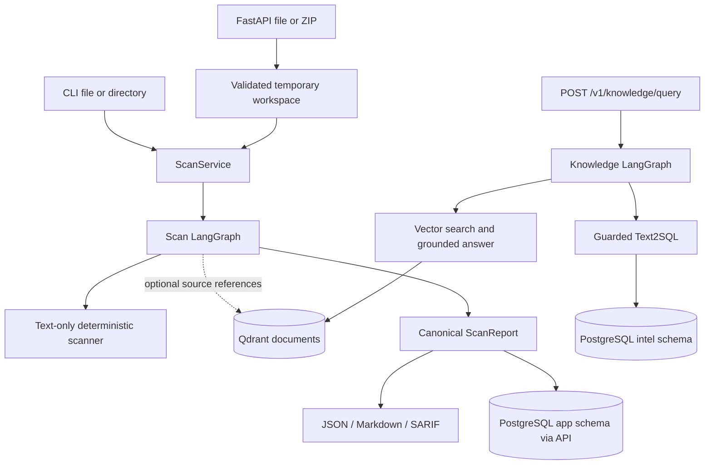

# 아키텍처

SecRAGraph는 Python 모듈형 단일 서비스입니다. 정적 스캔과 지식 질의가 같은 API 프로세스에 있지만, 서로 다른 LangGraph와 의존성 경계를 가집니다. [README](../README.md)의 빠른 시작은 이 구조의 로컬 Compose 배치를 사용합니다.

## 요청과 데이터 흐름



CLI는 `scan_path`로 로컬 파일·디렉터리를 스캔하고 그 자리에서 보고서를 렌더링합니다. 기본 CLI 그래프에는 retriever가 없으며 PostgreSQL에 보고서를 저장하지 않습니다. API의 `ScanService`는 영속 보고서 저장소를 받고, 설정된 키와 인프라가 있으면 Qdrant retriever도 연결합니다. API는 한 파일 또는 검증한 ZIP을 동기적으로 처리하고 결과를 `app.scan_reports` 등에 저장합니다. Streamlit은 API를 호출하는 얇은 데모 클라이언트입니다.

## 두 LangGraph의 실제 노드

스캔 그래프([scan_graph.py](../src/security_review/orchestrator/scan_graph.py)):

```text
validate_input → deterministic_scan → normalize_findings
→ retrieve_finding_evidence → calculate_risk → build_report
```

`retrieve_finding_evidence`는 규칙 결과의 `references`에 Qdrant 문서 출처를 합칩니다. finding ID, 탐지 위치, 심각도, CWE 매핑, 수정 권고는 결정적 결과를 유지합니다. 이 노드는 ChatModel 또는 PostgreSQL Text2SQL을 호출하지 않습니다. 검색 불가·시간 한도 초과 시 확인된 finding을 보존하고 `completed_with_warnings` 보고서를 만들 수 있습니다. 스캔 경로의 기본 수정 권고는 LLM 생성 문장이 아닙니다.

지식 그래프([knowledge_graph.py](../src/security_review/orchestrator/knowledge_graph.py)):

```text
classify_intent ─┬→ general_answer → END
                 ├→ text2sql → END
                 └→ vector_search → evaluate_vector_results
                       ├→ generate_grounded_answer → END
                       ├→ rewrite_query → vector_search (bounded retry)
                       └→ END (insufficient evidence)
```

분류·일반 답변·검색어 재작성·근거 기반 답변은 설정된 ChatModel을 사용합니다. RAG 답변은 실제 검색 chunk ID를 `[source:<id>]` 형식으로 인용해야 하며 없는 출처 ID를 반환하면 오류가 됩니다. 일반 답변은 문서나 DB 조회를 수행하지 않으므로 인용 근거가 없는 개념 설명입니다. Text2SQL은 별도 [보안 경계](text2sql-security.md)를 거칩니다.

키 없는 [오프라인 RAG 증거 명령](demo.md#2-키-없는-오프라인-rag-근거)은 같은 지식 LangGraph와 `QdrantDocumentRetriever`를 사용하되, 동봉한 Markdown 지침을 메모리 내 Qdrant에 인덱싱하고 결정적 토큰 해시 임베딩·응답 어댑터로 네 가지 고정 경로를 실행합니다. 완료된 노드, 검색 후보 메타데이터, 실제 인용 ID 및 인용된 조각의 짧은 발췌만 JSON/Markdown으로 렌더링합니다. 검색됐지만 인용되지 않은 조각의 원문과 LangGraph 원시 상태 전체는 저장하지 않습니다. 이 경로의 결과는 워크플로·검색·인용 계약의 재현 가능한 검사이며 실제 모델 답변 품질 측정은 아닙니다.

## 모듈과 인터페이스

| 위치 | 책임 / 외부 경계 |
| --- | --- |
| `src/security_review/domain/models.py`, `risk.py` | 검증된 `Finding`, `SourceReference`, `ScanReport`와 결정적 위험 점수. FastAPI·DB·모델 SDK에 의존하지 않습니다. |
| `scanner/files.py`, `rules.py`, `engine.py`, `redaction.py` | 지원 파일 탐색·한도, 텍스트 규칙, 결과 생성, 비밀 증거 마스킹. 제출 코드를 import하거나 실행하지 않습니다. |
| `uploads/service.py`, `archive.py` | 파일명·MIME·크기 검증, ZIP 경로·링크·개수·압축 해제량 검사 후 임시 디렉터리 사용. |
| `application.py` | CLI의 `scan_path`와 API의 `ScanService`; 같은 스캔 그래프를 조립하고 API 경로에서는 보고서를 저장합니다. |
| `orchestrator/scan_graph.py`, `knowledge_graph.py`, `state.py` | 각 LangGraph의 상태, 노드, 조건부 분기와 결과 계약. |
| `ports.py` | `ReportRepository`, `SecurityKnowledgeRepository`, `SecurityDocumentRetriever`, `ChatModel`, `EmbeddingModel` 프로토콜. 구현을 도메인 밖에 둡니다. |
| `intelligence/ingestion.py`, `models.py` | 사용자 소유 UTF-8 Markdown 문서 탐색·chunk 및 지식 데이터 모델. |
| `intelligence/qdrant_retriever.py`, `openai_adapters.py` | 컬렉션/차원 확인, bounded 검색·임베딩·모델 제공자 어댑터. |
| `intelligence/text2sql.py`, `sql_guard.py` | 모델 SQL 생성·재시도·답변 합성 및 SQLGlot AST 검증. |
| `storage/database.py`, `reports.py`, `memory.py`, `models.py` | SQLAlchemy 연결·스캔 보고서 영속화·테스트용 메모리 저장소·테이블. |
| `storage/intelligence.py`, `audit.py` | 합성 CSV 형식 검증과 `intel` 적재, 읽기 전용 쿼리 실행, 내용 없는 감사 이벤트 저장. |
| `reporting/builder.py`, `types.py`, `json_report.py`, `markdown.py`, `sarif.py` | 하나의 `ScanReport` 정규화와 JSON/Markdown/SARIF 2.1.0 렌더링. |
| `evaluation/offline_rag.py`, `rag_models.py`, `rag_render.py` | 고정 매니페스트·인덱싱된 chunk digest·실제 RAG 그래프 경로를 평가하고 제한된 증거를 렌더링. |
| `scripts/run_rag_evidence.py` | 키 없는 RAG 평가를 실행하고 JSON/Markdown 파일을 원자적으로 기록하며 라벨 불일치를 실패로 반환. |
| `evaluation/scanner_benchmark.py`, `scanner_models.py` | 합성 스캐너 사례를 공개 스캔 경로로 평가하고 정확 일치 지표와 커버리지를 계산. |
| `scripts/run_scanner_benchmark.py` | 엄격한 오프라인 스캐너 벤치마크를 실행하고 JSON/Markdown 증거를 기록. |
| `api/app.py`, `dependencies.py`, `schemas.py`, `middleware.py`, `errors.py` | FastAPI 조립, 주입 경계, 검증된 요청, 상관 ID와 안전한 오류 응답. |
| `api/routes/scans.py`, `reports.py`, `knowledge.py`, `health.py` | 파일·ZIP 업로드, 영속 보고서 조회/렌더링, 지식 질의, 생존/준비 상태 HTTP 경로. |
| `cli.py`, `apps/api/`, `apps/web/` | Typer CLI, Uvicorn 진입점, Streamlit 데모. |
| `audit.py`, `observability.py`, `config.py` | 허용 목록 기반 감사 이벤트, 구조화 로그, 환경 기반 설정. |

`migrations/`는 `app`과 `intel` 스키마 및 읽기 권한을 만들고, `infra/postgres/init/`은 reader 로그인을 부트스트랩합니다. [Compose](../compose.yaml)는 PostgreSQL·Qdrant·API·웹과 일회성 초기화 서비스를 연결합니다. [CI](../.github/workflows/ci.yml)와 [보안 셀프 스캔](../.github/workflows/security-scan.yml)은 코드에 포함된 워크플로 정의이며, 호스팅 실행 성공의 증거와는 구별해야 합니다.

HTTP 계약은 `GET /health/live`, `GET /health/ready`, `POST /v1/scans/file`, `POST /v1/scans/archive`, `GET /v1/scans/{scan_id}`, `GET /v1/scans/{scan_id}/report?format=markdown|sarif`, `POST /v1/knowledge/query`입니다. JSON 보고서는 저장된 canonical report이고 Markdown/SARIF은 같은 보고서에서 렌더링합니다.

## 스캐너 규칙과 측정 경계

스캐너는 Python 파일의 `eval`, `subprocess`/`os.system`, `requests` TLS 설정, 명시적 위험 PyYAML 로더 호출을 실행 없이 AST로 읽습니다. `SEC001`은 지원 텍스트 파일의 비밀 유사 값을 마스킹하고, `JS001`은 JavaScript/TypeScript 또는 `.env`의 명시적 Node TLS 검증 해제 할당을 제한된 어휘 검사로 찾습니다. JS 템플릿 문자열 안의 보간 코드는 평가하지 않습니다. Python 구문 분석이 실패하면 텍스트 규칙은 계속 검사하고 `python_syntax_error` 경고를 보고하며, 이 사례를 정상 사례 오경보율 분모에 넣지 않습니다.

`scripts.run_scanner_benchmark`는 저장소가 작성한 39개 합성 사례를 임시 파일로 분리해 공개 `scan_path`로 검사합니다. 정확한 `(사례 ID, 규칙 ID, 시작 줄)` 집합으로 TP·FP·FN을 계산하고, 읽지 못한 사례·파싱 경고·진단을 별도 커버리지로 남깁니다. 기본 실행은 불일치와 커버리지 실패 시 비정상 종료하며, `build/evidence/`의 JSON/Markdown에는 재현 가능한 필드만 기록합니다. [변경 전 측정](evidence/scanner-baseline.md)과 [현재 수치 및 재현 명령](demo.md#11-합성-스캐너-벤치마크)은 이 고정 코퍼스에만 적용됩니다.

## 실패와 신뢰 경계

정적 규칙은 키 없이 동작합니다. API 스캔 영속화는 PostgreSQL이 필요하며 `/health/ready`는 PostgreSQL과 Qdrant 상태를 확인합니다. 임베딩·모델 기능에는 런타임 `SECRAGRAPH_OPENAI_API_KEY`, 맞는 Qdrant 컬렉션, 수집된 문서 또는 `intel` 데이터가 필요합니다. 구성되지 않은 지식 API는 503을 반환합니다. Text2SQL SQL이 안전 기준을 통과하지 못하면 DB를 조회하지 않습니다.

업로드·검색 문서·DB 행·모델 결과는 모두 신뢰하지 않는 데이터입니다. 입력 크기, SQL 권한, 결과 길이, 출처 식별자를 각 경계에서 제한합니다. 남은 위험과 운영 전제는 [위협 모델](threat-model.md)과 [운영 문서](operations.md)에 있습니다.
